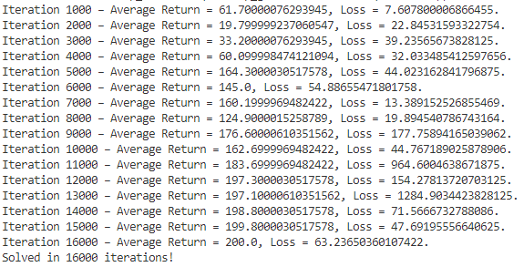
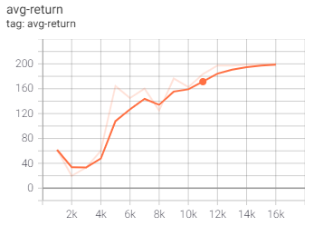

# rl-dqn
 Reinforcement Learning - DQN examples

## OpenAI Gym PONG

References:  
* https://torres.ai/deep-reinforcement-learning-explained-series/,  

* https://github.com/jorditorresBCN/Deep-Reinforcement-Learning-Explained/blob/master/DRL_15_16_17_DQN_Pong.ipynb

## Train a Deep Q Network with TF-Agents

This second example shows how to train a DQN (Deep Q Networks) agent on the cartpole environment using the TF-Agents library. It is the "hello World" project for TF-Agents.

References:

- https://www.tensorflow.org/agents/tutorials/1_dqn_tutorial
- https://rubikscode.net/2019/12/23/ultimate-guide-to-deep-q-learning-with-tf-agents/

Training this environment using a simple network with one hidden layer with 100 neurons yields the maximum average return of 200 after 16000 iterations:

The training took approximatly 25 min. on my computer (I7, 1 GPU). 

A video showing the trained agent over 5 episodes is available in the folder videos:

A video was also generated using a random policy. 

The code for defining the TF-Agent and training it is in main.py. The code for generating these videos is in play.py 

Conclusions:

1. A DQN can be trained successfully for the cartpole environment
2. Using a RL framework like TF-Agents simplifies greatly the code. Of course, there is a learning curve...

